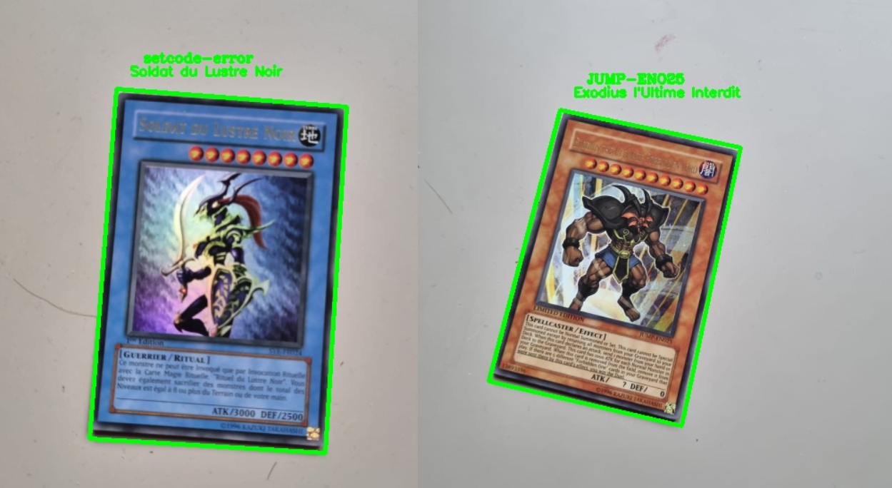

# Yu-Gi-Oh Card Recognition with One-Shot Learning

Welcome to the Yu-Gi-Oh Card Recognition project! This repository contains the code and resources necessary to perform one-shot learning for recognizing Yu-Gi-Oh cards. 

## Table of Contents

- [Context](#introduction)
- [Demo](#demo)

## Context

One-shot learning is a powerful technique for recognizing objects with very limited examples. In this project, we apply one-shot learning to recognize Yu-Gi-Oh cards using a deep learning model. Whether you're a Yu-Gi-Oh enthusiast or just interested in computer vision and machine learning, this project can help you get started with one-shot learning.

## Demo

## Card Detection and Recognition

In this project, we have divided the card recognition process into two main steps: card detection and card recognition. 

### Card Detection

To locate and identify the Yu-Gi-Oh card within an image, we have utilized OpenCV. OpenCV is a powerful computer vision library that helps us find the card's contours and extract relevant regions. Although our current card detection approach is based on traditional computer vision techniques, there is potential for improvement by integrating AI-based recognition tools like ResNet.

Using an AI-based model, such as ResNet, for card detection could enhance the accuracy and robustness of the detection process. This approach might better handle complex scenarios, different lighting conditions, and variations in card orientations. Future enhancements to this project could involve implementing and fine-tuning such AI-based detection methods.

### Card Recognition

For the actual recognition of the Yu-Gi-Oh card, we employ AI-based techniques. Our deep learning model, described earlier, has been trained to recognize the specific features and patterns on Yu-Gi-Oh cards. This model is capable of making accurate predictions based on the images of the cards.

By combining traditional computer vision for card detection and deep learning for card recognition, we have created a comprehensive system for identifying Yu-Gi-Oh cards efficiently.
